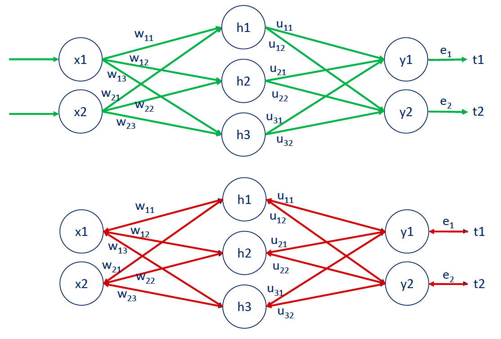

# Deep Learning

## Neural Networks
Creating a machine learning algorithm means getting the right output from an input. Before getting comfortable about the output, we must train the model properly so that it can work with new data confidently.

To train the model:
1. Data: We need a lot of data with the correct outputs.
2. Model: Find a model (such as a linear one) to fit the data
3. Objective Function: Estimates how correct the models outputs are on average
4. Optimization Algorithm: Vary the parameters to get better objective functions

Types of Machine Learning:
1. Supervised: We provide the algorithm with a set of inputs and the correct corresponding outputs. It then learns to produce outputs close to the ones we are looking for.
2. Unsupervised: We feed inputs with no target outputs. We just ask the model to find some pattern or underlying logic behind the data.
3. Reinforcement: We train a model based on the rewards it receives. Basically, the algorithm does a bunch of stuff based on what it receives good feedback for.

Supervised Learning can be split into classification and regression. For this section of the course, we will only be doing supervised learning.

### The Linear Model
Lets suppose we have two variables x and y, and we wish to find the linear model between them. We have pairs of data where, 
$$y = f(x)$$

Now, in order to find the model, we give the algorithm a bunch of these pairs so that it can find the pattern needed between x and y in terms of coefficients. 

$$f(x) = xw + b$$

In this case, w is the weight of the input x, and b is the bias. 

Note that we can have more than one input. Instead of adding multiple variables and weights, we simply make x a row vector, and the w a column vector. Then, when calculating y, we simply multiply the vectors. Pretty sure this can be done with matrices as well when having more than one output.

### Objective Function
The measure used to evaluate how well the model's outputs match the desired correct values. There are two types: 

1. Loss Functions: The lower the loss function, the higher the accuracy of the model.
2. Reward Functions: The higher the reward function, the higher the accuracy. Usually used in reinforcement.

The target (T) is the expected output from the algorithm.

There are two common loss functions. For regression, we use L2-Norm. It is the sum of squared errors between the outputs obtained and the corresponding targets. 

For classification, we use cross-entropy. This is really hard to write down, use lecture 328 for reference. 

### Optimization Algorithms
The most fundamental algorithm is the gradient descent. 
1. Find the derivative of the function f(x) as f'(x)
2. Set a random x0 (such as x0 = 4)
3. Then, iteratively calculate the formula:
    $$x_{i+1} = x_i - \eta f'(x_i)$$

    where $$\eta (eta)$$ is the learning rate.

4. Iterate through until f'(xi) becomes 0 (the value of x becomes constant), meaning that we get:
$$x_{i+1} = x_i$$

Generally, we want the learning rate to be high enough where we can reach the closest minimum in a rational amount of time, but low enough such that we don't vary around the minimum arbitrarily.

---
## TensorFlow
Tensors are actual mathematical objects; they come after matrices. If we think about it, the hierarchy for these objects in terms of dimensions is as follows: scalar (1x1) -> Vector (1xn) -> Matrix (nxn) etc. 

All of these objects (scalar, vector, matrix) are actually tensors. They are tensors of rank 0, 1, and 2 respectively. Higher rank tensors simply have more dimensions and are used to store even more complex data.

---
## Deep Neural Networks
Often, a simple linear model is not good enough to truly capture the logic of the data. Instead, we often wish to find the linear + non-linear model outlining the data. To do this, our simple and single-layered neural network from before won't cut it. When we have more than one layer, we call it a **deep neural network**.

### What is a deep net?

There are three layers to the deep neural network (or the deep net): input, hidden and output. Deep nets have more than one hidden layer, and these layers are where all the processing happens in the model.

The building blocks of a hidden layer are called **hidden units or hidden nodes**. The width of a deep net is the number of individual units or nodes in a hidden layer. The depth of a deep net is the number of hidden layers. The width and depth are called the hyperparameters. Parameters are found by optimizing, while hyperparameters are set by us for the model.

#### Why the non-linearity?
Now, we know that in between the calculation for each hidden layer we add a non-linearity to the function. Why? By introducing non-linearity, we are able to **stack layers**.
    
Stacking layers is the process of placing one layer after the other in a meaningful way.

Imagine we have a linear model between each hidden layer, at the end, we can simply substitute each hidden layer as the linear formula it represents, leading to another linear formula at the outputs which could have been derived from a simple neural network instead of a deep one, making the deep net completely useless. 

#### Activation Functions

In machine learning, the non-linearities are called the activation functions. Activation functions transform inputs into outputs of a different kind (linear to non-linear).

Some common activation functions (both the function and its derivative for optimization functions):

All common activation functions need to be monotonic(always increases or always decreases; never changes direction), continuous and differentiable. 

Activation functions are also called transfer functions in machine learning context.

#### Softmax Activation Function
This activation function does not take each input individually, but considers all of them (dividing by the sum of the exponential raised to each input).

The softmax transformation transforms a bunch of arbitrarily large or small numbers into a valid probability distribution. It is often used as the activation for the final output layer in classification problems. 

### Backpropagation
At the end of each epoch (after forward propogating to the output layer), we calculate the errors between the outputs and targets. Then, we send the errors back to each hidden layer from the output layer, and change each parameter accordingly. Backpropagating is sending the delta errors back to each hidden layer. 

