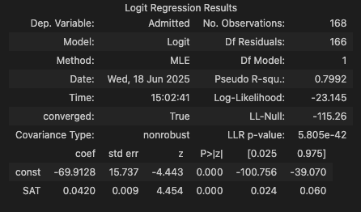

# Logistic Regression

While Linear Regression is used to predict a value, logistic regression is often used to figure out categorical stuff.
An example would be the following:
 - Linear Regression can be used to figure out what price a person will purchase the product at
 - Logistic Regression can tell us whether the customer will buy at all

## The Logistic Model
 - The logistic regression predicts the probability of an event occurring
 - Given the input, how probable is the outcome?
 - The equation of the Logit form (a special form of the logistic equation) is:

$$
\log\left( \frac{p(\mathbf{x})}{1 - p(\mathbf{x})} \right) = \beta_0 + \beta_1 x_1 + \beta_2 x_2 + \cdots + \beta_k x_k
$$

   Where p(x) is the probability of an event happening.

   We can also simplify this to:
   $$\log(odds) = \beta_0 + \beta_1 x_1 + \beta_2 x_2 + \cdots + \beta_k x_k$$

## Understanding the Summary Table

### MLE (Maximum Likelihood Function)
This is based off of a Likelihood Function, which is a function that estimates how likely it is that the model at hand describes the real underlying relationship between variables. The bigger the likelihood function, the higher the probability that our model is correct.

MLE tries to maximise the likelihood function. The computer is going through different values, until it finds a model for which the likelihood is highest. When it can no longer improve the model, it stops the optimization.

### Log-Likelihood
The value of the log-likelihood is always negative, and the bigger it is the better. 

### LL-Null (Log-Likelihood-Null)
The log-likelihood of a model which has no independent variables. We compare the log-likelihood with the LL-Null to see whether the model has any explanatory power, since if its equal that means just having no independent variables at all. 

### LLR p-value (Log-likelihood ratio)
Measures if our model is statistically different from LL-null, which means checking if the model is actually significant.

### Pseudo R-squared
We can't actually have an R-squared for logistic regressions, so we kind of just use this to compare the variations of the same model to see how they differ. A good value lies between 0.2 and 0.4.

## Interpreting the Summary Table from SAT-Admittance

According to our table here, we can see that our model ends being:
$$\log\left( \frac{\pi}{1 - \pi} \right) = -69.9128 + 0.0420 \cdot \text{SAT}$$

The identity of $$\frac{\pi}{1 - \pi}$$ is called the odds, where π is the probability of an event occuring and 1 - π is the probability of an event not occurring.